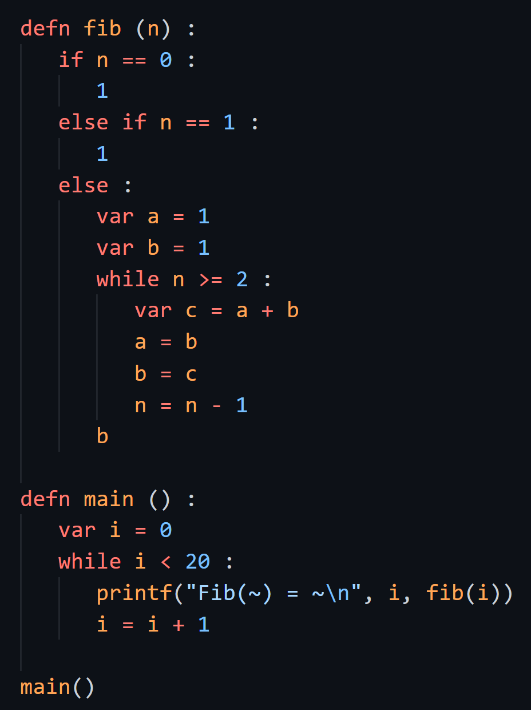

# Feeny

This package provides basic language support for Feeny.
Feeny is a small programming languages for learning how to implement dynamic languages and their runtimes.

Feeny was introduced in the U.C. Berkeley course [*Virtual Machines and Managed Runtimes*](http://www.wolczko.com/CS294/index.html), taught by Mario Wolczko and Patrick S. Li.
Its syntax is largely inspired by another language called [Stanza](http://lbstanza.org/).

You can read more about Feeny [on the course materials home page](http://www.wolczko.com/CS294/index.html), or on [the implementation's GitHub repository](https://github.com/CuppoJava/Feeny).

## Features

This package includes support for

* Syntax highlighting
* Brace completion
* Smart indentation
* Comment toggling

